# Documento de Design - Colaboração em Tempo Real

## Visão Geral

A funcionalidade de colaboração em tempo real transformará listas compartilhadas em espaços de trabalho colaborativo dinâmicos, onde múltiplos usuários podem interagir simultaneamente com feedback visual imediato, comunicação contextual e sincronização automática de alterações.

### Conceitos Principais

- **Presença**: Indicadores visuais de usuários ativos na lista
- **Cursores Colaborativos**: Indicadores de onde outros usuários estão interagindo
- **Operational Transformation**: Algoritmo para resolver conflitos de edição simultânea
- **Activity Feed**: Stream de atividades em tempo real
- **Contextual Communication**: Comentários e reações vinculados a itens específicos

## Arquitetura

### Componentes Principais

```
┌─────────────────────────────────────────────────────────────┐
│                 CollaborativeListView                       │
│  ┌─────────────────┐  ┌─────────────────┐  ┌──────────────┐ │
│  │ PresenceBar     │  │  ActivityFeed   │  │ CommentPanel │ │
│  └─────────────────┘  └─────────────────┘  └──────────────┘ │
│  ┌─────────────────┐  ┌─────────────────┐  ┌──────────────┐ │
│  │ CollabListItem  │  │ ReactionPicker  │  │ QuickNotes   │ │
│  └─────────────────┘  └─────────────────┘  └──────────────┘ │
└─────────────────────────────────────────────────────────────┘
                              │
                              ▼
┌─────────────────────────────────────────────────────────────┐
│              CollaborationEngine                            │
│  ┌─────────────────┐  ┌─────────────────┐  ┌──────────────┐ │
│  │ PresenceManager │  │ ConflictResolver│  │ SyncManager  │ │
│  └─────────────────┘  └─────────────────┘  └──────────────┘ │
│  ┌─────────────────┐  ┌─────────────────┐  ┌──────────────┐ │
│  │ OperationalTx   │  │ ActivityTracker │  │ CommentMgr   │ │
│  └─────────────────┘  └─────────────────┘  └──────────────┘ │
└─────────────────────────────────────────────────────────────┘
                              │
                              ▼
┌─────────────────────────────────────────────────────────────┐
│           Supabase Realtime + WebSocket                     │
│  ┌─────────────────┐  ┌─────────────────┐  ┌──────────────┐ │
│  │   presence      │  │   operations    │  │  activities  │ │
│  └─────────────────┘  └─────────────────┘  └──────────────┘ │
└─────────────────────────────────────────────────────────────┘
```

### Fluxo de Operational Transformation

```mermaid
sequenceDiagram
    participant U1 as Usuário 1
    participant U2 as Usuário 2
    participant OT as OperationalTx
    participant DB as Database
    
    U1->>OT: Operação: Insert("leite", pos=2)
    U2->>OT: Operação: Insert("pão", pos=2)
    
    OT->>OT: Transform operations
    Note over OT: Op1: Insert("leite", pos=2)<br/>Op2: Insert("pão", pos=3)
    
    OT->>DB: Apply Op1
    OT->>DB: Apply Op2
    
    DB->>U1: Result: ["item1", "item2", "leite", "pão"]
    DB->>U2: Result: ["item1", "item2", "leite", "pão"]
```



## Componentes e Interfaces

### 1. CollaborationEngine

```typescript
interface CollaborationEngine {
  // Gerenciamento de presença
  joinSession(listId: string, userId: string): Promise<void>;
  leaveSession(listId: string, userId: string): Promise<void>;
  updatePresence(listId: string, presence: UserPresence): Promise<void>;
  
  // Operações colaborativas
  applyOperation(operation: CollaborativeOperation): Promise<void>;
  transformOperation(op1: CollaborativeOperation, op2: CollaborativeOperation): CollaborativeOperation[];
  
  // Comunicação
  addComment(itemId: string, comment: Comment): Promise<void>;
  addReaction(itemId: string, reaction: Reaction): Promise<void>;
  addQuickNote(itemId: string, note: QuickNote): Promise<void>;
}

interface UserPresence {
  userId: string;
  userName: string;
  avatar?: string;
  cursor?: CursorPosition;
  isTyping: boolean;
  lastSeen: Date;
  color: string; // Cor única para identificação visual
}

interface CursorPosition {
  itemId?: string;
  fieldName?: string;
  position?: number;
  action: 'viewing' | 'editing' | 'selecting';
}

interface CollaborativeOperation {
  id: string;
  type: 'insert' | 'delete' | 'update' | 'move';
  itemId?: string;
  position?: number;
  content?: any;
  userId: string;
  timestamp: Date;
  listId: string;
}
```

### 2. PresenceManager

```typescript
interface PresenceManager {
  getActiveUsers(listId: string): Promise<UserPresence[]>;
  subscribeToPresence(listId: string, callback: (users: UserPresence[]) => void): () => void;
  updateUserCursor(listId: string, cursor: CursorPosition): Promise<void>;
  setTypingStatus(listId: string, isTyping: boolean): Promise<void>;
}

interface PresenceBarProps {
  activeUsers: UserPresence[];
  maxVisible: number;
  onUserClick: (user: UserPresence) => void;
}
```

### 3. ActivityTracker

```typescript
interface ActivityTracker {
  trackActivity(activity: Activity): Promise<void>;
  getActivityFeed(listId: string, limit?: number): Promise<Activity[]>;
  subscribeToActivities(listId: string, callback: (activity: Activity) => void): () => void;
}

interface Activity {
  id: string;
  type: 'item_added' | 'item_removed' | 'item_updated' | 'item_purchased' | 'comment_added' | 'reaction_added';
  listId: string;
  itemId?: string;
  userId: string;
  userName: string;
  userAvatar?: string;
  content?: any;
  timestamp: Date;
  metadata?: {
    oldValue?: any;
    newValue?: any;
    itemName?: string;
  };
}

interface ActivityFeedProps {
  activities: Activity[];
  onActivityClick: (activity: Activity) => void;
  groupSimilar: boolean;
  maxItems: number;
}
```

### 4. CommentManager

```typescript
interface CommentManager {
  addComment(itemId: string, comment: Omit<Comment, 'id' | 'createdAt'>): Promise<Comment>;
  getComments(itemId: string): Promise<Comment[]>;
  updateComment(commentId: string, content: string): Promise<void>;
  deleteComment(commentId: string): Promise<void>;
  subscribeToComments(itemId: string, callback: (comments: Comment[]) => void): () => void;
}

interface Comment {
  id: string;
  itemId: string;
  userId: string;
  userName: string;
  userAvatar?: string;
  content: string;
  createdAt: Date;
  updatedAt?: Date;
  isEdited: boolean;
  mentions?: string[]; // IDs de usuários mencionados
}

interface CommentPanelProps {
  itemId: string;
  comments: Comment[];
  onAddComment: (content: string) => void;
  onEditComment: (commentId: string, content: string) => void;
  onDeleteComment: (commentId: string) => void;
}
```

### 5. ReactionManager

```typescript
interface ReactionManager {
  addReaction(itemId: string, reaction: ReactionType): Promise<void>;
  removeReaction(itemId: string, reaction: ReactionType): Promise<void>;
  getReactions(itemId: string): Promise<ItemReactions>;
  subscribeToReactions(itemId: string, callback: (reactions: ItemReactions) => void): () => void;
}

enum ReactionType {
  THUMBS_UP = '👍',
  QUESTION = '❓',
  WARNING = '⚠️',
  HEART = '❤️',
  LAUGH = '😂',
  URGENT = '🔥'
}

interface ItemReactions {
  itemId: string;
  reactions: {
    [key in ReactionType]?: {
      count: number;
      users: Array<{
        userId: string;
        userName: string;
        timestamp: Date;
      }>;
    };
  };
}

interface ReactionPickerProps {
  itemId: string;
  currentReactions: ItemReactions;
  onReactionSelect: (reaction: ReactionType) => void;
  position: 'top' | 'bottom' | 'left' | 'right';
}
```

## Modelos de Dados

### Tabela user_presence

```sql
CREATE TABLE user_presence (
  id UUID PRIMARY KEY DEFAULT gen_random_uuid(),
  list_id UUID NOT NULL REFERENCES lists(id) ON DELETE CASCADE,
  user_id UUID NOT NULL REFERENCES auth.users(id) ON DELETE CASCADE,
  user_name VARCHAR(255) NOT NULL,
  user_avatar TEXT,
  cursor_data JSONB,
  is_typing BOOLEAN DEFAULT false,
  last_seen TIMESTAMP DEFAULT NOW(),
  color VARCHAR(7) NOT NULL, -- Hex color code
  created_at TIMESTAMP DEFAULT NOW(),
  
  UNIQUE(list_id, user_id)
);

-- Índices
CREATE INDEX idx_user_presence_list_id ON user_presence(list_id);
CREATE INDEX idx_user_presence_last_seen ON user_presence(last_seen);

-- Auto-cleanup de presença antiga
CREATE OR REPLACE FUNCTION cleanup_old_presence()
RETURNS void AS $$
BEGIN
  DELETE FROM user_presence 
  WHERE last_seen < NOW() - INTERVAL '5 minutes';
END;
$$ LANGUAGE plpgsql;

-- Executar limpeza a cada minuto
SELECT cron.schedule('cleanup-presence', '* * * * *', 'SELECT cleanup_old_presence();');
```

### Tabela collaborative_operations

```sql
CREATE TABLE collaborative_operations (
  id UUID PRIMARY KEY DEFAULT gen_random_uuid(),
  list_id UUID NOT NULL REFERENCES lists(id) ON DELETE CASCADE,
  operation_type VARCHAR(20) NOT NULL CHECK (operation_type IN ('insert', 'delete', 'update', 'move')),
  item_id UUID REFERENCES list_items(id) ON DELETE CASCADE,
  position INTEGER,
  content JSONB,
  user_id UUID NOT NULL REFERENCES auth.users(id),
  timestamp TIMESTAMP DEFAULT NOW(),
  applied BOOLEAN DEFAULT false,
  
  -- Para ordenação e resolução de conflitos
  vector_clock JSONB DEFAULT '{}',
  parent_operation_id UUID REFERENCES collaborative_operations(id)
);

-- Índices para performance
CREATE INDEX idx_collab_ops_list_id ON collaborative_operations(list_id);
CREATE INDEX idx_collab_ops_timestamp ON collaborative_operations(timestamp);
CREATE INDEX idx_collab_ops_applied ON collaborative_operations(applied);
```

### Tabela item_comments

```sql
CREATE TABLE item_comments (
  id UUID PRIMARY KEY DEFAULT gen_random_uuid(),
  item_id UUID NOT NULL REFERENCES list_items(id) ON DELETE CASCADE,
  user_id UUID NOT NULL REFERENCES auth.users(id),
  content TEXT NOT NULL,
  mentions JSONB DEFAULT '[]', -- Array de user IDs mencionados
  created_at TIMESTAMP DEFAULT NOW(),
  updated_at TIMESTAMP,
  is_edited BOOLEAN DEFAULT false
);

-- Índices
CREATE INDEX idx_item_comments_item_id ON item_comments(item_id);
CREATE INDEX idx_item_comments_user_id ON item_comments(user_id);
CREATE INDEX idx_item_comments_created_at ON item_comments(created_at);

-- RLS Policies
ALTER TABLE item_comments ENABLE ROW LEVEL SECURITY;

CREATE POLICY "Users can view comments on accessible lists" ON item_comments
  FOR SELECT USING (
    item_id IN (
      SELECT li.id FROM list_items li
      JOIN lists l ON li.list_id = l.id
      WHERE l.user_id = auth.uid() OR 
            l.id IN (SELECT list_id FROM list_shares WHERE user_id = auth.uid())
    )
  );
```

### Tabela item_reactions

```sql
CREATE TABLE item_reactions (
  id UUID PRIMARY KEY DEFAULT gen_random_uuid(),
  item_id UUID NOT NULL REFERENCES list_items(id) ON DELETE CASCADE,
  user_id UUID NOT NULL REFERENCES auth.users(id) ON DELETE CASCADE,
  reaction VARCHAR(10) NOT NULL, -- Emoji unicode
  created_at TIMESTAMP DEFAULT NOW(),
  
  UNIQUE(item_id, user_id, reaction)
);

-- Índices
CREATE INDEX idx_item_reactions_item_id ON item_reactions(item_id);
CREATE INDEX idx_item_reactions_user_id ON item_reactions(user_id);

-- View para agregação de reações
CREATE VIEW item_reactions_summary AS
SELECT 
  item_id,
  reaction,
  COUNT(*) as count,
  ARRAY_AGG(
    JSON_BUILD_OBJECT(
      'userId', user_id,
      'timestamp', created_at
    ) ORDER BY created_at
  ) as users
FROM item_reactions
GROUP BY item_id, reaction;
```

### Tabela quick_notes

```sql
CREATE TABLE quick_notes (
  id UUID PRIMARY KEY DEFAULT gen_random_uuid(),
  item_id UUID NOT NULL REFERENCES list_items(id) ON DELETE CASCADE,
  user_id UUID NOT NULL REFERENCES auth.users(id) ON DELETE CASCADE,
  content TEXT NOT NULL,
  is_temporary BOOLEAN DEFAULT true,
  expires_at TIMESTAMP DEFAULT (NOW() + INTERVAL '1 hour'),
  created_at TIMESTAMP DEFAULT NOW()
);

-- Auto-cleanup de notas temporárias expiradas
CREATE OR REPLACE FUNCTION cleanup_expired_notes()
RETURNS void AS $$
BEGIN
  DELETE FROM quick_notes 
  WHERE is_temporary = true AND expires_at < NOW();
END;
$$ LANGUAGE plpgsql;

SELECT cron.schedule('cleanup-notes', '*/15 * * * *', 'SELECT cleanup_expired_notes();');
```

## Algoritmo de Operational Transformation

### Implementação Base

```typescript
class OperationalTransform {
  // Transforma operação A contra operação B
  static transform(opA: CollaborativeOperation, opB: CollaborativeOperation): [CollaborativeOperation, CollaborativeOperation] {
    if (opA.type === 'insert' && opB.type === 'insert') {
      return this.transformInsertInsert(opA, opB);
    }
    
    if (opA.type === 'delete' && opB.type === 'delete') {
      return this.transformDeleteDelete(opA, opB);
    }
    
    if (opA.type === 'insert' && opB.type === 'delete') {
      return this.transformInsertDelete(opA, opB);
    }
    
    if (opA.type === 'delete' && opB.type === 'insert') {
      const [transformedB, transformedA] = this.transformInsertDelete(opB, opA);
      return [transformedA, transformedB];
    }
    
    // Casos de update
    return this.transformUpdate(opA, opB);
  }
  
  private static transformInsertInsert(opA: CollaborativeOperation, opB: CollaborativeOperation): [CollaborativeOperation, CollaborativeOperation] {
    const posA = opA.position || 0;
    const posB = opB.position || 0;
    
    if (posA <= posB) {
      // A insere antes ou na mesma posição que B
      return [
        opA, // A não muda
        { ...opB, position: posB + 1 } // B move uma posição para frente
      ];
    } else {
      // A insere depois de B
      return [
        { ...opA, position: posA + 1 }, // A move uma posição para frente
        opB // B não muda
      ];
    }
  }
  
  private static transformDeleteDelete(opA: CollaborativeOperation, opB: CollaborativeOperation): [CollaborativeOperation, CollaborativeOperation] {
    const posA = opA.position || 0;
    const posB = opB.position || 0;
    
    if (posA === posB) {
      // Deletando o mesmo item - apenas uma operação é válida
      return [
        opA,
        { ...opB, type: 'noop' as any } // B se torna no-op
      ];
    }
    
    if (posA < posB) {
      return [
        opA, // A não muda
        { ...opB, position: posB - 1 } // B ajusta posição
      ];
    } else {
      return [
        { ...opA, position: posA - 1 }, // A ajusta posição
        opB // B não muda
      ];
    }
  }
}
```

## Tratamento de Conflitos

### Estratégias de Resolução

```typescript
class ConflictResolver {
  async resolveConflict(
    localOp: CollaborativeOperation,
    remoteOp: CollaborativeOperation
  ): Promise<CollaborativeOperation[]> {
    
    // Estratégia 1: Last-Write-Wins para updates simples
    if (localOp.type === 'update' && remoteOp.type === 'update' && 
        localOp.itemId === remoteOp.itemId) {
      
      if (remoteOp.timestamp > localOp.timestamp) {
        return [remoteOp]; // Remote wins
      } else {
        return [localOp]; // Local wins
      }
    }
    
    // Estratégia 2: Merge inteligente para campos diferentes
    if (this.canMergeOperations(localOp, remoteOp)) {
      return [this.mergeOperations(localOp, remoteOp)];
    }
    
    // Estratégia 3: Operational Transformation
    const [transformedLocal, transformedRemote] = OperationalTransform.transform(localOp, remoteOp);
    return [transformedLocal, transformedRemote];
  }
  
  private canMergeOperations(op1: CollaborativeOperation, op2: CollaborativeOperation): boolean {
    return op1.itemId === op2.itemId && 
           op1.type === 'update' && 
           op2.type === 'update' &&
           !this.hasFieldConflict(op1.content, op2.content);
  }
  
  private mergeOperations(op1: CollaborativeOperation, op2: CollaborativeOperation): CollaborativeOperation {
    return {
      ...op1,
      content: {
        ...op1.content,
        ...op2.content
      },
      timestamp: new Date()
    };
  }
}
```

## Estratégia de Testes

### Testes de Operational Transformation

```typescript
describe('OperationalTransform', () => {
  test('should handle concurrent inserts correctly', () => {
    const opA: CollaborativeOperation = {
      id: '1',
      type: 'insert',
      position: 2,
      content: { name: 'leite' },
      userId: 'user1',
      timestamp: new Date(),
      listId: 'list1'
    };
    
    const opB: CollaborativeOperation = {
      id: '2',
      type: 'insert',
      position: 2,
      content: { name: 'pão' },
      userId: 'user2',
      timestamp: new Date(),
      listId: 'list1'
    };
    
    const [transformedA, transformedB] = OperationalTransform.transform(opA, opB);
    
    expect(transformedA.position).toBe(2);
    expect(transformedB.position).toBe(3);
  });
});
```

### Testes de Colaboração

```typescript
describe('CollaborationEngine', () => {
  test('should sync presence updates in real-time', async () => {
    const engine = new CollaborationEngine();
    const mockCallback = jest.fn();
    
    // User 1 joins
    await engine.joinSession('list1', 'user1');
    
    // Subscribe to presence updates
    engine.subscribeToPresence('list1', mockCallback);
    
    // User 2 joins
    await engine.joinSession('list1', 'user2');
    
    expect(mockCallback).toHaveBeenCalledWith(
      expect.arrayContaining([
        expect.objectContaining({ userId: 'user1' }),
        expect.objectContaining({ userId: 'user2' })
      ])
    );
  });
});
```

## Performance e Otimização

### Otimizações de Rede

1. **Debouncing**: Agrupar operações rápidas em batches
2. **Compression**: Comprimir payloads de sincronização
3. **Delta Sync**: Enviar apenas diferenças, não estado completo
4. **Connection Pooling**: Reutilizar conexões WebSocket

### Otimizações de Interface

```typescript
class PresenceOptimizer {
  private presenceCache = new Map<string, UserPresence>();
  private updateQueue: UserPresence[] = [];
  private batchTimeout?: NodeJS.Timeout;
  
  updatePresence(presence: UserPresence) {
    this.presenceCache.set(presence.userId, presence);
    this.updateQueue.push(presence);
    
    // Batch updates para evitar re-renders excessivos
    if (this.batchTimeout) {
      clearTimeout(this.batchTimeout);
    }
    
    this.batchTimeout = setTimeout(() => {
      this.flushUpdates();
    }, 100); // 100ms de debounce
  }
  
  private flushUpdates() {
    if (this.updateQueue.length > 0) {
      this.onPresenceUpdate(Array.from(this.presenceCache.values()));
      this.updateQueue = [];
    }
  }
}
```

## Considerações de Acessibilidade

### Screen Readers

```typescript
interface AccessibilityAnnouncements {
  userJoined: (userName: string) => string;
  userLeft: (userName: string) => string;
  itemAdded: (itemName: string, userName: string) => string;
  itemPurchased: (itemName: string, userName: string) => string;
  commentAdded: (userName: string, itemName: string) => string;
}

const announcements: AccessibilityAnnouncements = {
  userJoined: (userName) => `${userName} entrou na lista`,
  userLeft: (userName) => `${userName} saiu da lista`,
  itemAdded: (itemName, userName) => `${userName} adicionou ${itemName}`,
  itemPurchased: (itemName, userName) => `${userName} marcou ${itemName} como comprado`,
  commentAdded: (userName, itemName) => `${userName} comentou em ${itemName}`
};
```

### Navegação por Teclado

- **Tab**: Navegar entre itens da lista
- **Enter**: Abrir painel de comentários
- **Space**: Marcar/desmarcar item
- **Ctrl+/**: Abrir seletor de reações
- **Esc**: Fechar painéis abertos