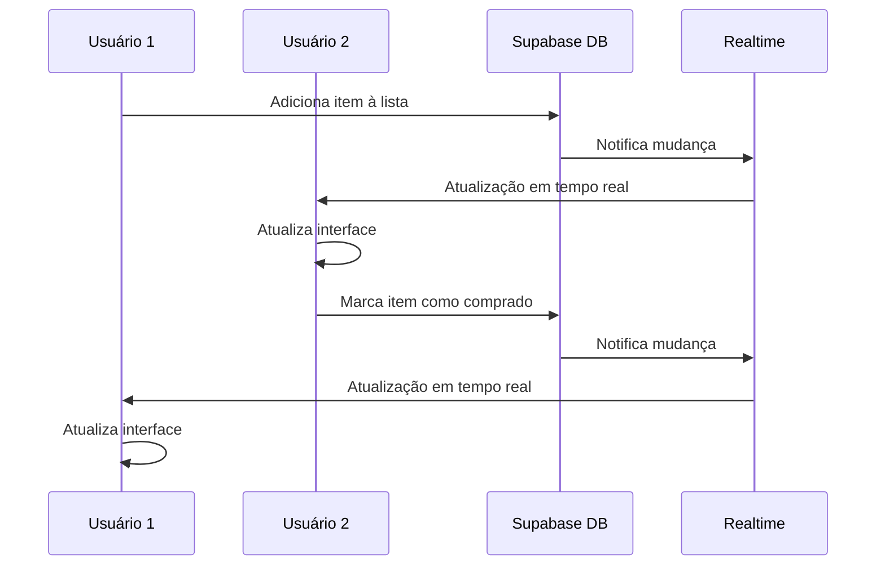

# Documento de Design - Compartilhamento de Listas

## Visão Geral

A funcionalidade de compartilhamento de listas permitirá colaboração em tempo real entre múltiplos usuários em uma mesma lista de compras. O sistema será construído sobre a infraestrutura existente do Supabase, utilizando Row Level Security (RLS) para controle de acesso e Realtime para sincronização automática entre participantes.

### Conceitos Principais

- **Proprietário**: Usuário que criou a lista e tem controle total
- **Participante**: Usuário convidado com permissões específicas
- **Convite**: Solicitação de compartilhamento enviada a um usuário
- **Permissões**: Níveis de acesso (visualizar, editar, administrar)

## Arquitetura

### Componentes Principais

```
┌─────────────────────────────────────────────────────────────┐
│                    ShareListModal                           │
│  ┌─────────────────┐  ┌─────────────────┐  ┌──────────────┐ │
│  │   UserSearch    │  │ PermissionPicker│  │ InviteList   │ │
│  └─────────────────┘  └─────────────────┘  └──────────────┘ │
└─────────────────────────────────────────────────────────────┘
                              │
                              ▼
┌─────────────────────────────────────────────────────────────┐
│                 SharingService                              │
│  ┌─────────────────┐  ┌─────────────────┐  ┌──────────────┐ │
│  │ InviteManager   │  │ PermissionMgr   │  │ NotificationMgr│ │
│  └─────────────────┘  └─────────────────┘  └──────────────┘ │
└─────────────────────────────────────────────────────────────┘
                              │
                              ▼
┌─────────────────────────────────────────────────────────────┐
│              Supabase Realtime + Database                   │
│  ┌─────────────────┐  ┌─────────────────┐  ┌──────────────┐ │
│  │ list_shares     │  │   invitations   │  │ notifications│ │
│  └─────────────────┘  └─────────────────┘  └──────────────┘ │
└─────────────────────────────────────────────────────────────┘
```

### Fluxo de Dados em Tempo Real



## Componentes e Interfaces

### 1. ShareListModal Component

```typescript
interface ShareListModalProps {
  listId: string;
  isVisible: boolean;
  onClose: () => void;
  currentShares: ListShare[];
}

interface ListShare {
  id: string;
  listId: string;
  userId: string;
  userEmail: string;
  userName: string;
  permission: SharePermission;
  createdAt: Date;
  acceptedAt?: Date;
}

enum SharePermission {
  VIEW = 'view',
  EDIT = 'edit',
  ADMIN = 'admin'
}
```

### 2. SharingService

```typescript
interface SharingService {
  inviteUser(listId: string, userEmail: string, permission: SharePermission): Promise<Invitation>;
  acceptInvitation(invitationId: string): Promise<void>;
  rejectInvitation(invitationId: string): Promise<void>;
  updatePermission(shareId: string, permission: SharePermission): Promise<void>;
  removeParticipant(shareId: string): Promise<void>;
  leaveList(listId: string): Promise<void>;
  transferOwnership(listId: string, newOwnerId: string): Promise<void>;
  generateShareLink(listId: string, permission: SharePermission, expiresIn?: number): Promise<ShareLink>;
}

interface Invitation {
  id: string;
  listId: string;
  inviterUserId: string;
  inviteeEmail: string;
  permission: SharePermission;
  status: InvitationStatus;
  expiresAt: Date;
  createdAt: Date;
}

enum InvitationStatus {
  PENDING = 'pending',
  ACCEPTED = 'accepted',
  REJECTED = 'rejected',
  EXPIRED = 'expired'
}

interface ShareLink {
  id: string;
  listId: string;
  token: string;
  permission: SharePermission;
  expiresAt: Date;
  maxUses?: number;
  currentUses: number;
}
```

### 3. NotificationService

```typescript
interface NotificationService {
  sendInvitationNotification(invitation: Invitation): Promise<void>;
  sendListUpdateNotification(listId: string, action: string, userId: string): Promise<void>;
  sendParticipantJoinedNotification(listId: string, newParticipant: User): Promise<void>;
  sendParticipantLeftNotification(listId: string, leftParticipant: User): Promise<void>;
}

interface NotificationPreferences {
  listUpdates: boolean;
  newParticipants: boolean;
  participantLeft: boolean;
  listCompleted: boolean;
  emailNotifications: boolean;
  pushNotifications: boolean;
}
```

## Modelos de Dados

### Tabela list_shares

```sql
CREATE TABLE list_shares (
  id UUID PRIMARY KEY DEFAULT gen_random_uuid(),
  list_id UUID NOT NULL REFERENCES lists(id) ON DELETE CASCADE,
  user_id UUID NOT NULL REFERENCES auth.users(id) ON DELETE CASCADE,
  permission VARCHAR(10) NOT NULL CHECK (permission IN ('view', 'edit', 'admin')),
  created_at TIMESTAMP DEFAULT NOW(),
  created_by UUID NOT NULL REFERENCES auth.users(id),
  
  UNIQUE(list_id, user_id)
);

-- Índices para performance
CREATE INDEX idx_list_shares_list_id ON list_shares(list_id);
CREATE INDEX idx_list_shares_user_id ON list_shares(user_id);

-- RLS Policies
ALTER TABLE list_shares ENABLE ROW LEVEL SECURITY;

-- Usuários podem ver compartilhamentos de listas que possuem ou participam
CREATE POLICY "Users can view list shares they participate in" ON list_shares
  FOR SELECT USING (
    user_id = auth.uid() OR 
    list_id IN (
      SELECT id FROM lists WHERE user_id = auth.uid()
    ) OR
    list_id IN (
      SELECT list_id FROM list_shares WHERE user_id = auth.uid()
    )
  );

-- Apenas proprietários podem criar/modificar compartilhamentos
CREATE POLICY "List owners can manage shares" ON list_shares
  FOR ALL USING (
    list_id IN (
      SELECT id FROM lists WHERE user_id = auth.uid()
    )
  );
```

### Tabela invitations

```sql
CREATE TABLE invitations (
  id UUID PRIMARY KEY DEFAULT gen_random_uuid(),
  list_id UUID NOT NULL REFERENCES lists(id) ON DELETE CASCADE,
  inviter_user_id UUID NOT NULL REFERENCES auth.users(id),
  invitee_email VARCHAR(255) NOT NULL,
  invitee_user_id UUID REFERENCES auth.users(id),
  permission VARCHAR(10) NOT NULL CHECK (permission IN ('view', 'edit', 'admin')),
  status VARCHAR(10) NOT NULL DEFAULT 'pending' CHECK (status IN ('pending', 'accepted', 'rejected', 'expired')),
  expires_at TIMESTAMP NOT NULL DEFAULT (NOW() + INTERVAL '7 days'),
  created_at TIMESTAMP DEFAULT NOW(),
  responded_at TIMESTAMP,
  
  UNIQUE(list_id, invitee_email)
);

-- Índices
CREATE INDEX idx_invitations_invitee_email ON invitations(invitee_email);
CREATE INDEX idx_invitations_invitee_user_id ON invitations(invitee_user_id);
CREATE INDEX idx_invitations_status ON invitations(status);

-- RLS Policies
ALTER TABLE invitations ENABLE ROW LEVEL SECURITY;

-- Convidadores podem ver convites que enviaram
CREATE POLICY "Inviters can view their invitations" ON invitations
  FOR SELECT USING (inviter_user_id = auth.uid());

-- Convidados podem ver convites direcionados a eles
CREATE POLICY "Invitees can view their invitations" ON invitations
  FOR SELECT USING (
    invitee_user_id = auth.uid() OR 
    invitee_email = (SELECT email FROM auth.users WHERE id = auth.uid())
  );

-- Apenas convidadores podem criar convites
CREATE POLICY "Inviters can create invitations" ON invitations
  FOR INSERT WITH CHECK (inviter_user_id = auth.uid());

-- Convidados podem atualizar status de seus convites
CREATE POLICY "Invitees can update invitation status" ON invitations
  FOR UPDATE USING (
    invitee_user_id = auth.uid() OR 
    invitee_email = (SELECT email FROM auth.users WHERE id = auth.uid())
  );
```

### Tabela share_links

```sql
CREATE TABLE share_links (
  id UUID PRIMARY KEY DEFAULT gen_random_uuid(),
  list_id UUID NOT NULL REFERENCES lists(id) ON DELETE CASCADE,
  token VARCHAR(255) NOT NULL UNIQUE,
  permission VARCHAR(10) NOT NULL CHECK (permission IN ('view', 'edit', 'admin')),
  expires_at TIMESTAMP NOT NULL,
  max_uses INTEGER,
  current_uses INTEGER DEFAULT 0,
  created_by UUID NOT NULL REFERENCES auth.users(id),
  created_at TIMESTAMP DEFAULT NOW(),
  is_active BOOLEAN DEFAULT true
);

-- Índices
CREATE INDEX idx_share_links_token ON share_links(token);
CREATE INDEX idx_share_links_list_id ON share_links(list_id);

-- RLS Policies
ALTER TABLE share_links ENABLE ROW LEVEL SECURITY;

-- Apenas proprietários da lista podem gerenciar links
CREATE POLICY "List owners can manage share links" ON share_links
  FOR ALL USING (
    list_id IN (
      SELECT id FROM lists WHERE user_id = auth.uid()
    )
  );
```

### Extensão da Tabela lists

```sql
-- Adicionar colunas para controle de compartilhamento
ALTER TABLE lists 
ADD COLUMN is_shared BOOLEAN DEFAULT false,
ADD COLUMN share_settings JSONB DEFAULT '{"allowInvites": true, "defaultPermission": "edit"}';

-- Função para atualizar is_shared automaticamente
CREATE OR REPLACE FUNCTION update_list_shared_status()
RETURNS TRIGGER AS $$
BEGIN
  UPDATE lists 
  SET is_shared = EXISTS(SELECT 1 FROM list_shares WHERE list_id = NEW.list_id)
  WHERE id = NEW.list_id;
  RETURN NEW;
END;
$$ LANGUAGE plpgsql;

-- Trigger para atualizar status automaticamente
CREATE TRIGGER trigger_update_list_shared_status
  AFTER INSERT OR DELETE ON list_shares
  FOR EACH ROW
  EXECUTE FUNCTION update_list_shared_status();
```

## Tratamento de Erros

### Cenários de Erro e Respostas

1. **Usuário não encontrado**
   - Validar email antes de enviar convite
   - Sugerir criação de conta para emails não cadastrados
   - Permitir convite pendente até usuário se cadastrar

2. **Permissões insuficientes**
   - Verificar permissões antes de cada ação
   - Exibir mensagens claras sobre limitações
   - Atualizar interface baseada em permissões do usuário

3. **Conflitos de sincronização**
   - Implementar resolução de conflitos por timestamp
   - Notificar usuários sobre conflitos resolvidos
   - Manter histórico de alterações para auditoria

4. **Falha na conexão em tempo real**
   - Implementar reconexão automática
   - Sincronizar alterações perdidas ao reconectar
   - Exibir status de conectividade para usuário

### Implementação de Resolução de Conflitos

```typescript
class ConflictResolver {
  async resolveListItemConflict(
    localItem: ListItem, 
    remoteItem: ListItem
  ): Promise<ListItem> {
    // Estratégia: última modificação vence
    if (remoteItem.updatedAt > localItem.updatedAt) {
      return remoteItem;
    }
    
    // Para campos específicos, usar merge inteligente
    return {
      ...localItem,
      // Quantidade: usar maior valor
      quantity: Math.max(localItem.quantity, remoteItem.quantity),
      // Status comprado: true vence (alguém já comprou)
      isPurchased: localItem.isPurchased || remoteItem.isPurchased,
      // Notas: concatenar se diferentes
      notes: this.mergeNotes(localItem.notes, remoteItem.notes),
      updatedAt: new Date()
    };
  }
}
```

## Estratégia de Testes

### Testes Unitários

1. **SharingService**
   - Teste de criação e envio de convites
   - Teste de aceitação/rejeição de convites
   - Teste de gerenciamento de permissões
   - Teste de geração de links de compartilhamento

2. **NotificationService**
   - Teste de envio de notificações
   - Teste de preferências de notificação
   - Teste de templates de mensagem

3. **ConflictResolver**
   - Teste de resolução de conflitos simples
   - Teste de merge de dados complexos
   - Teste de cenários edge case

### Testes de Integração

1. **Fluxo completo de compartilhamento**
   - Convidar → Aceitar → Colaborar → Sincronizar
   - Teste com diferentes níveis de permissão
   - Teste de múltiplos participantes simultâneos

2. **Sincronização em tempo real**
   - Teste de atualizações instantâneas
   - Teste de reconexão após perda de rede
   - Teste de resolução de conflitos

### Testes de Performance

1. **Escalabilidade**: Testar com 10+ participantes por lista
2. **Latência**: Sincronização < 500ms em condições normais
3. **Throughput**: Suportar múltiplas alterações simultâneas

## Considerações de Segurança

### Controle de Acesso

1. **Validação de permissões**: Verificar em cada operação
2. **Tokens seguros**: Links de compartilhamento com tokens únicos
3. **Expiração**: Convites e links com tempo de vida limitado
4. **Auditoria**: Log de todas as ações de compartilhamento

### Privacidade

1. **Dados pessoais**: Não expor informações desnecessárias
2. **Histórico**: Manter apenas dados essenciais
3. **Exclusão**: Remover dados ao sair da lista
4. **Consentimento**: Confirmar antes de compartilhar dados

## Integração com Sistema Existente

### Modificações Necessárias

1. **ListCard Component**: Adicionar indicadores visuais para listas compartilhadas
2. **ListService**: Estender para suportar operações colaborativas
3. **AuthContext**: Incluir gerenciamento de convites pendentes
4. **Navigation**: Adicionar seção para listas compartilhadas

### Compatibilidade

1. **Listas existentes**: Manter funcionamento normal
2. **Migração**: Processo suave para ativar compartilhamento
3. **Fallback**: Funcionar offline com sincronização posterior
4. **Performance**: Não impactar listas não compartilhadas

## Notificações Push

### Configuração

```typescript
interface PushNotificationConfig {
  listUpdated: {
    title: string;
    body: string;
    data: {
      listId: string;
      action: string;
      userId: string;
    };
  };
  newParticipant: {
    title: string;
    body: string;
    data: {
      listId: string;
      participantName: string;
    };
  };
  invitationReceived: {
    title: string;
    body: string;
    data: {
      invitationId: string;
      listName: string;
      inviterName: string;
    };
  };
}
```

### Implementação com Expo Notifications

```typescript
class PushNotificationService {
  async sendListUpdateNotification(
    userTokens: string[], 
    listName: string, 
    action: string
  ) {
    const message = {
      to: userTokens,
      sound: 'default',
      title: 'Lista Atualizada',
      body: `${listName}: ${action}`,
      data: { type: 'list_update' }
    };
    
    await fetch('https://exp.host/--/api/v2/push/send', {
      method: 'POST',
      headers: {
        'Content-Type': 'application/json',
      },
      body: JSON.stringify(message),
    });
  }
}
```