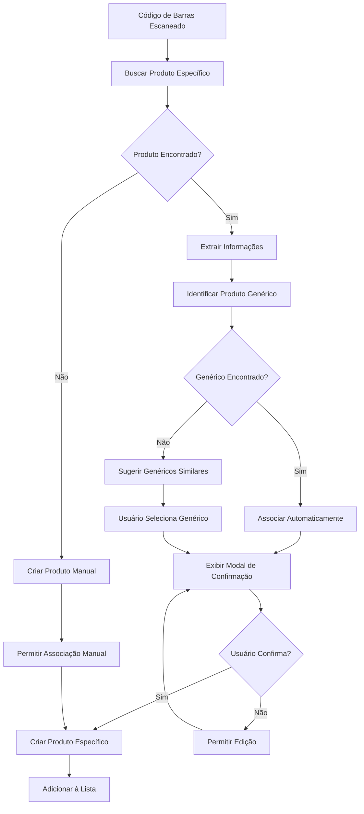

# Documento de Design - Leitura de Código de Barras

## Visão Geral

A funcionalidade de leitura de código de barras será implementada como uma extensão do sistema existente de adição de produtos, integrando-se seamlessly com os componentes `AddProductInterface` e `ProductSelector`. O sistema utilizará a câmera do dispositivo para capturar códigos de barras de **produtos específicos** (com marca e embalagem definida), processará os dados localmente quando possível, e buscará informações em APIs externas para enriquecer os dados do produto.

### Hierarquia de Produtos

O sistema trabalha com dois níveis de produtos:

1. **Produtos Genéricos**: Categorias amplas como "Arroz", "Macarrão", "Leite" (pré-cadastrados no sistema)
2. **Produtos Específicos**: Produtos com marca, tamanho e características específicas como "Arroz Tio João Tipo 1 1kg", "Macarrão Barilla Penne 500g"

Quando um código de barras é escaneado, o sistema:
- Identifica o produto específico através do código
- Associa automaticamente ao produto genérico correspondente
- Permite ao usuário confirmar ou ajustar a associação

## Arquitetura

### Componentes Principais

```
┌─────────────────────────────────────────────────────────────┐
│                    BarcodeScanner                           │
│  ┌─────────────────┐  ┌─────────────────┐  ┌──────────────┐ │
│  │   CameraView    │  │  ScanOverlay    │  │ ScanResults  │ │
│  └─────────────────┘  └─────────────────┘  └──────────────┘ │
└─────────────────────────────────────────────────────────────┘
                              │
                              ▼
┌─────────────────────────────────────────────────────────────┐
│                 BarcodeService                              │
│  ┌─────────────────┐  ┌─────────────────┐  ┌──────────────┐ │
│  │ LocalDatabase   │  │  ExternalAPIs   │  │ CacheManager │ │
│  └─────────────────┘  └─────────────────┘  └──────────────┘ │
└─────────────────────────────────────────────────────────────┘
                              │
                              ▼
┌─────────────────────────────────────────────────────────────┐
│              Integração com Sistema Existente               │
│  ┌─────────────────┐  ┌─────────────────┐  ┌──────────────┐ │
│  │ ProductService  │  │   ListService   │  │ PriceService │ │
│  └─────────────────┘  └─────────────────┘  └──────────────┘ │
└─────────────────────────────────────────────────────────────┘
```

### Fluxo de Dados

1. **Captura**: CameraView captura frames da câmera
2. **Detecção**: Algoritmo de ML detecta códigos de barras nos frames
3. **Processamento**: BarcodeService processa o código detectado
4. **Busca Local**: Verifica cache local e banco de dados
5. **Busca Externa**: Se necessário, consulta APIs externas (Cosmos, Open Food Facts)
6. **Enriquecimento**: Combina dados de múltiplas fontes
7. **Associação Genérica**: Identifica ou sugere produtos genéricos correspondentes
8. **Apresentação**: Exibe resultado com opções de produto genérico para confirmação
9. **Confirmação**: Usuário confirma ou ajusta a associação genérica
10. **Criação**: Cria produto específico vinculado ao genérico
11. **Integração**: Adiciona produto à lista através do sistema existente

### Fluxo de Associação com Produtos Genéricos



## Componentes e Interfaces

### 1. BarcodeScanner Component

```typescript
interface BarcodeScannerProps {
  onBarcodeDetected: (barcode: string, type: BarcodeType) => void;
  onClose: () => void;
  isVisible: boolean;
}

interface BarcodeResult {
  code: string;
  type: BarcodeType;
  bounds?: BoundingBox;
}

enum BarcodeType {
  EAN13 = 'EAN13',
  EAN8 = 'EAN8',
  UPCA = 'UPCA',
  UPCE = 'UPCE',
  QR = 'QR'
}
```

### 2. BarcodeService

```typescript
interface BarcodeService {
  scanBarcode(code: string): Promise<ProductInfo>;
  searchLocal(code: string): Promise<ProductInfo | null>;
  searchExternal(code: string): Promise<ProductInfo | null>;
  cacheProduct(code: string, product: ProductInfo): Promise<void>;
  findGenericProduct(productName: string, category: string): Promise<GenericProduct | null>;
  suggestGenericProducts(productName: string): Promise<GenericProduct[]>;
  createSpecificProduct(productInfo: ProductInfo, genericProductId: string): Promise<SpecificProduct>;
}

interface GenericProduct {
  id: string;
  name: string;
  category: string;
  isEssentiallyGeneric: boolean; // true para frutas, verduras sem marca
}

interface SpecificProduct {
  id: string;
  name: string;
  brand?: string;
  barcode: string;
  genericProductId: string;
  weight?: string;
  volume?: string;
  image?: string;
}

interface ProductInfo {
  barcode: string;
  name: string; // Nome do produto específico (ex: "Arroz Tio João Tipo 1 1kg")
  brand?: string;
  category?: string;
  image?: string;
  description?: string;
  nutritionalInfo?: NutritionalInfo;
  source: 'local' | 'cosmos' | 'openfoodfacts' | 'manual';
  confidence: number;
  genericProduct?: {
    id: string;
    name: string; // Nome genérico (ex: "Arroz")
    category: string;
  };
  metadata?: {
    ncm?: string;
    taxInfo?: TaxInfo;
    unit?: string;
    gtin?: string;
    weight?: string;
    volume?: string;
  };
}

interface TaxInfo {
  icms: number;
  ipi: number;
  pis_cofins: number;
}
```

### 3. ScanResultModal Component

```typescript
interface ScanResultModalProps {
  productInfo: ProductInfo;
  suggestedGenericProducts: GenericProduct[];
  selectedGenericProduct?: GenericProduct;
  onConfirm: (product: ProductInfo, genericProduct: GenericProduct, price?: PriceInfo) => void;
  onEdit: (product: ProductInfo) => void;
  onGenericProductChange: (genericProduct: GenericProduct) => void;
  onCancel: () => void;
  suggestedStore?: Store;
}

interface PriceInfo {
  price: number;
  unit: string;
  store: Store;
  date: Date;
}
```

## Modelos de Dados

### Extensão da Tabela de Produtos

```sql
-- Adicionar colunas à tabela specific_products
ALTER TABLE specific_products 
ADD COLUMN barcode VARCHAR(50) UNIQUE,
ADD COLUMN barcode_type VARCHAR(20),
ADD COLUMN external_id VARCHAR(100),
ADD COLUMN data_source VARCHAR(50) DEFAULT 'manual',
ADD COLUMN confidence_score DECIMAL(3,2),
ADD COLUMN last_external_sync TIMESTAMP;

-- Índice para busca rápida por código de barras
CREATE INDEX idx_specific_products_barcode ON specific_products(barcode);
```

### Cache de Códigos de Barras

```sql
CREATE TABLE barcode_cache (
  id UUID PRIMARY KEY DEFAULT gen_random_uuid(),
  barcode VARCHAR(50) NOT NULL,
  barcode_type VARCHAR(20) NOT NULL,
  product_data JSONB NOT NULL,
  source VARCHAR(50) NOT NULL,
  confidence_score DECIMAL(3,2),
  created_at TIMESTAMP DEFAULT NOW(),
  expires_at TIMESTAMP,
  user_id UUID REFERENCES auth.users(id)
);

CREATE INDEX idx_barcode_cache_barcode ON barcode_cache(barcode);
CREATE INDEX idx_barcode_cache_user ON barcode_cache(user_id);
```

## Tratamento de Erros

### Cenários de Erro e Respostas

1. **Câmera não disponível**
   - Exibir mensagem explicativa
   - Oferecer entrada manual como alternativa
   - Verificar permissões e solicitar se necessário

2. **Código de barras não reconhecido**
   - Permitir entrada manual do código
   - Oferecer criação de produto personalizado
   - Sugerir melhor posicionamento

3. **Falha na API externa**
   - Usar dados do cache local se disponível
   - Permitir criação manual com sincronização posterior
   - Exibir status de conectividade

4. **Produto não encontrado**
   - Oferecer criação de novo produto
   - Sugerir produtos similares baseado no código
   - Permitir associação com produto genérico existente

### Implementação de Retry e Fallback

```typescript
class BarcodeService {
  async searchWithFallback(code: string): Promise<ProductInfo> {
    try {
      // 1. Busca local primeiro (mais rápido)
      const localResult = await this.searchLocal(code);
      if (localResult && this.isDataFresh(localResult)) {
        return localResult;
      }

      // 2. Busca na API Cosmos (produtos brasileiros)
      const cosmosResult = await this.cosmosService.getProductByGTIN(code);
      if (cosmosResult) {
        await this.cacheProduct(code, cosmosResult);
        return cosmosResult;
      }

      // 3. Fallback para Open Food Facts (produtos internacionais)
      const openFoodResult = await this.openFoodFactsService.getProduct(code);
      if (openFoodResult) {
        await this.cacheProduct(code, openFoodResult);
        return openFoodResult;
      }

      // 4. Fallback para dados locais mesmo se antigos
      if (localResult) {
        return { ...localResult, confidence: 0.5 };
      }

      // 5. Último recurso: produto vazio para preenchimento manual
      return this.createEmptyProduct(code);
    } catch (error) {
      console.error('Barcode search failed:', error);
      return this.createEmptyProduct(code);
    }
  }
}
```

## Estratégia de Testes

### Testes Unitários

1. **BarcodeService**
   - Teste de busca local com diferentes cenários
   - Teste de integração com APIs externas
   - Teste de cache e sincronização
   - Teste de tratamento de erros

2. **BarcodeScanner Component**
   - Teste de detecção de códigos válidos
   - Teste de tratamento de códigos inválidos
   - Teste de permissões de câmera
   - Teste de diferentes tipos de código de barras

### Testes de Integração

1. **Fluxo completo de escaneamento**
   - Escanear → Buscar → Confirmar → Adicionar à lista
   - Teste com e sem conexão de internet
   - Teste com diferentes qualidades de imagem

2. **Integração com sistema existente**
   - Verificar compatibilidade com ProductSelector
   - Testar adição à lista via código de barras
   - Validar histórico de preços

### Testes de Performance

1. **Tempo de detecção**: < 2 segundos
2. **Uso de memória**: Monitorar vazamentos durante uso prolongado
3. **Bateria**: Otimizar uso da câmera e flash
4. **Rede**: Minimizar chamadas desnecessárias às APIs

## Considerações de Segurança

### Privacidade

1. **Dados de escaneamento**: Não armazenar imagens da câmera
2. **Cache local**: Criptografar dados sensíveis
3. **APIs externas**: Não enviar dados pessoais desnecessários

### Validação

1. **Códigos de barras**: Validar formato antes de processar
2. **Dados externos**: Sanitizar dados recebidos de APIs
3. **Entrada do usuário**: Validar preços e informações editadas

## Integração com APIs Externas

### Open Food Facts API

```typescript
interface OpenFoodFactsResponse {
  code: string;
  status: number;
  product?: {
    product_name: string;
    brands: string;
    categories: string;
    image_url: string;
    nutriments: object;
  };
}

class OpenFoodFactsService {
  async getProduct(barcode: string): Promise<ProductInfo | null> {
    const response = await fetch(
      `https://world.openfoodfacts.org/api/v0/product/${barcode}.json`
    );
    
    if (!response.ok) return null;
    
    const data: OpenFoodFactsResponse = await response.json();
    
    if (data.status === 0) return null;
    
    return this.transformToProductInfo(data.product, barcode);
  }
}
```

### Integração com API Cosmos

A API Cosmos será integrada como fonte primária para produtos brasileiros, fornecendo dados completos de catálogo:

```typescript
interface CosmosApiResponse {
  gtin: string;
  description: string;
  brand: string;
  ncm: string;
  tax_info: {
    icms: number;
    ipi: number;
    pis_cofins: number;
  };
  category: string;
  unit: string;
  image_url?: string;
}

class CosmosService {
  async getProductByGTIN(gtin: string): Promise<ProductInfo | null> {
    try {
      const response = await fetch(
        `https://api.cosmos.bluesoft.com.br/gtins/${gtin}`,
        {
          headers: {
            'X-Cosmos-Token': process.env.COSMOS_API_KEY,
            'User-Agent': 'GroceryApp/1.0'
          }
        }
      );

      if (!response.ok) return null;

      const data: CosmosApiResponse = await response.json();
      
      // Buscar produto genérico correspondente
      const genericProduct = await this.findGenericProduct(
        data.description, 
        this.mapCosmosCategory(data.category)
      );

      return {
        barcode: data.gtin,
        name: data.description,
        brand: data.brand,
        category: this.mapCosmosCategory(data.category),
        image: data.image_url,
        source: 'cosmos',
        confidence: 0.9,
        genericProduct,
        metadata: {
          ncm: data.ncm,
          taxInfo: data.tax_info,
          unit: data.unit,
          weight: this.extractWeight(data.description),
          volume: this.extractVolume(data.description)
        }
      };
    } catch (error) {
      console.error('Cosmos API error:', error);
      return null;
    }
  }
}
```

### Fallback para Outras APIs Brasileiras

- **Open Food Facts**: Para produtos internacionais e dados nutricionais
- **Tabelião de Preços**: Para dados governamentais de preços
- **APIs de supermercados**: Quando disponíveis (Extra, Carrefour, etc.)

## Performance e Otimização

### Otimizações de Câmera

1. **Resolução adaptativa**: Ajustar baseado na capacidade do dispositivo
2. **Frame rate**: Otimizar para detecção vs. bateria
3. **Região de interesse**: Focar detecção no centro da tela
4. **Auto-foco**: Configurar para macro quando necessário

### Cache Inteligente

1. **TTL dinâmico**: Produtos populares ficam mais tempo em cache
2. **Compressão**: Comprimir dados JSON para economizar espaço
3. **Limpeza automática**: Remover entradas antigas periodicamente
4. **Pré-carregamento**: Carregar produtos comuns antecipadamente