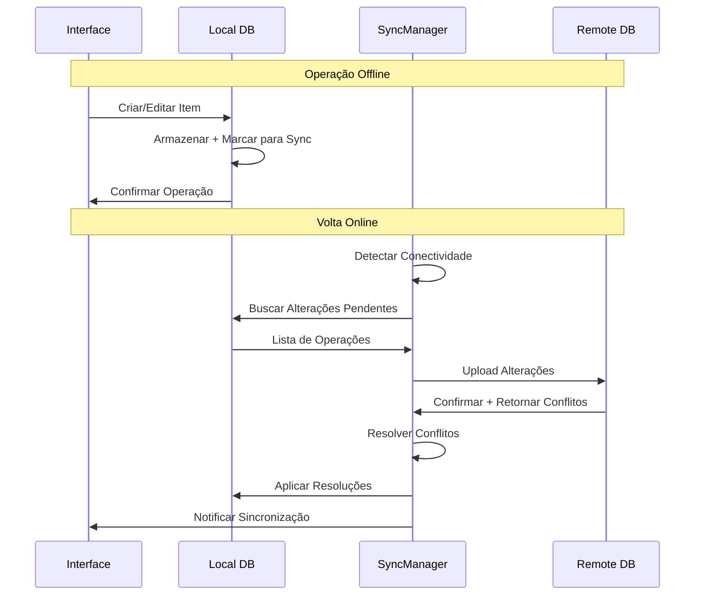

# Documento de Design - Modo Offline

## Visão Geral

O modo offline permitirá que o aplicativo funcione completamente sem conexão com internet, mantendo todas as funcionalidades essenciais disponíveis. O sistema utilizará SQLite local para armazenamento, implementará sincronização bidirecional inteligente e resolverá conflitos automaticamente quando a conexão for restaurada.

### Conceitos Principais

- **Local-First**: Dados são armazenados localmente primeiro, sincronizados depois
- **Eventual Consistency**: Todos os dispositivos convergem para o mesmo estado eventualmente
- **Conflict-Free Replicated Data Types (CRDTs)**: Estruturas de dados que se mesclam automaticamente
- **Optimistic UI**: Interface atualiza imediatamente, sincroniza em background
- **Delta Sync**: Apenas diferenças são sincronizadas para eficiência

## Arquitetura

### Componentes Principais

```
┌─────────────────────────────────────────────────────────────┐
│                    OfflineManager                           │
│  ┌─────────────────┐  ┌─────────────────┐  ┌──────────────┐ │
│  │ ConnectivityMgr │  │   SyncManager   │  │ ConflictMgr  │ │
│  └─────────────────┘  └─────────────────┘  └──────────────┘ │
└─────────────────────────────────────────────────────────────┘
                              │
                              ▼
┌─────────────────────────────────────────────────────────────┐
│                 LocalStorageEngine                          │
│  ┌─────────────────┐  ┌─────────────────┐  ┌──────────────┐ │
│  │   SQLiteDB      │  │   CacheManager  │  │ QueueManager │ │
│  └─────────────────┘  └─────────────────┘  └──────────────┘ │
└─────────────────────────────────────────────────────────────┘
                              │
                              ▼
┌─────────────────────────────────────────────────────────────┐
│              Data Synchronization Layer                     │
│  ┌─────────────────┐  ┌─────────────────┐  ┌──────────────┐ │
│  │ UploadQueue     │  │ DownloadQueue   │  │ MergeEngine  │ │
│  └─────────────────┘  └─────────────────┘  └──────────────┘ │
└─────────────────────────────────────────────────────────────┘
```

### Fluxo de Sincronização



## Componentes e Interfaces

### 1. OfflineManager

```typescript
interface OfflineManager {
  // Gerenciamento de conectividade
  isOnline(): boolean;
  subscribeToConnectivity(callback: (isOnline: boolean) => void): () => void;
  
  // Gerenciamento de dados offline
  enableOfflineMode(listIds?: string[]): Promise<void>;
  disableOfflineMode(): Promise<void>;
  getOfflineStatus(): OfflineStatus;
  
  // Sincronização
  syncNow(): Promise<SyncResult>;
  scheduleSync(): void;
  cancelSync(): void;
}

interface OfflineStatus {
  isEnabled: boolean;
  isOnline: boolean;
  pendingOperations: number;
  lastSyncTime?: Date;
  syncInProgress: boolean;
  availableStorage: number;
  usedStorage: number;
}

interface SyncResult {
  success: boolean;
  operationsSynced: number;
  conflictsResolved: number;
  errors: SyncError[];
  duration: number;
}
```

### 2. LocalStorageEngine

```typescript
interface LocalStorageEngine {
  // Operações CRUD offline
  createList(list: Omit<List, 'id'>): Promise<List>;
  updateList(id: string, updates: Partial<List>): Promise<List>;
  deleteList(id: string): Promise<void>;
  getList(id: string): Promise<List | null>;
  getAllLists(): Promise<List[]>;
  
  // Operações de itens
  createListItem(item: Omit<ListItem, 'id'>): Promise<ListItem>;
  updateListItem(id: string, updates: Partial<ListItem>): Promise<ListItem>;
  deleteListItem(id: string): Promise<void>;
  getListItems(listId: string): Promise<ListItem[]>;
  
  // Gerenciamento de operações pendentes
  queueOperation(operation: PendingOperation): Promise<void>;
  getPendingOperations(): Promise<PendingOperation[]>;
  markOperationSynced(operationId: string): Promise<void>;
}

interface PendingOperation {
  id: string;
  type: 'create' | 'update' | 'delete';
  entity: 'list' | 'list_item' | 'product';
  entityId: string;
  data: any;
  timestamp: Date;
  retryCount: number;
  lastError?: string;
}
```

### 3. SyncManager

```typescript
interface SyncManager {
  // Sincronização bidirecional
  syncUp(): Promise<UploadResult>;
  syncDown(): Promise<DownloadResult>;
  fullSync(): Promise<SyncResult>;
  
  // Gerenciamento de conflitos
  resolveConflicts(conflicts: DataConflict[]): Promise<ConflictResolution[]>;
  
  // Configuração
  setSyncStrategy(strategy: SyncStrategy): void;
  setSyncInterval(intervalMs: number): void;
  enableAutoSync(enabled: boolean): void;
}

interface DataConflict {
  id: string;
  entity: string;
  entityId: string;
  localVersion: any;
  remoteVersion: any;
  conflictType: 'update_update' | 'update_delete' | 'create_create';
  timestamp: Date;
}

interface ConflictResolution {
  conflictId: string;
  resolution: 'local_wins' | 'remote_wins' | 'merge' | 'manual';
  mergedData?: any;
  requiresUserInput?: boolean;
}

enum SyncStrategy {
  IMMEDIATE = 'immediate',
  BATCHED = 'batched',
  SCHEDULED = 'scheduled',
  MANUAL = 'manual'
}
```

### 4. ConnectivityManager

```typescript
interface ConnectivityManager {
  getCurrentStatus(): ConnectivityStatus;
  subscribeToChanges(callback: (status: ConnectivityStatus) => void): () => void;
  testConnection(): Promise<boolean>;
  getConnectionQuality(): Promise<ConnectionQuality>;
}

interface ConnectivityStatus {
  isOnline: boolean;
  connectionType: 'wifi' | 'cellular' | 'none';
  isMetered: boolean;
  signalStrength?: number;
  lastOnlineTime?: Date;
}

enum ConnectionQuality {
  EXCELLENT = 'excellent',
  GOOD = 'good',
  FAIR = 'fair',
  POOR = 'poor'
}
```

## Modelos de Dados Locais

### Schema SQLite Local

```sql
-- Tabela principal de listas (espelho da remota)
CREATE TABLE local_lists (
  id TEXT PRIMARY KEY,
  name TEXT NOT NULL,
  description TEXT,
  user_id TEXT NOT NULL,
  created_at TEXT NOT NULL,
  updated_at TEXT NOT NULL,
  is_shared BOOLEAN DEFAULT 0,
  
  -- Metadados de sincronização
  sync_status TEXT DEFAULT 'pending', -- 'synced', 'pending', 'conflict'
  last_synced_at TEXT,
  version INTEGER DEFAULT 1,
  is_deleted BOOLEAN DEFAULT 0
);

-- Tabela de itens de lista (espelho da remota)
CREATE TABLE local_list_items (
  id TEXT PRIMARY KEY,
  list_id TEXT NOT NULL,
  product_name TEXT NOT NULL,
  quantity INTEGER DEFAULT 1,
  unit TEXT,
  is_purchased BOOLEAN DEFAULT 0,
  notes TEXT,
  created_at TEXT NOT NULL,
  updated_at TEXT NOT NULL,
  
  -- Metadados de sincronização
  sync_status TEXT DEFAULT 'pending',
  last_synced_at TEXT,
  version INTEGER DEFAULT 1,
  is_deleted BOOLEAN DEFAULT 0,
  
  FOREIGN KEY (list_id) REFERENCES local_lists(id) ON DELETE CASCADE
);

-- Fila de operações pendentes
CREATE TABLE pending_operations (
  id TEXT PRIMARY KEY,
  operation_type TEXT NOT NULL, -- 'create', 'update', 'delete'
  entity_type TEXT NOT NULL, -- 'list', 'list_item', 'product'
  entity_id TEXT NOT NULL,
  data TEXT, -- JSON serializado
  created_at TEXT NOT NULL,
  retry_count INTEGER DEFAULT 0,
  last_error TEXT,
  priority INTEGER DEFAULT 0 -- Para ordenação de sincronização
);

-- Cache de produtos para uso offline
CREATE TABLE local_products (
  id TEXT PRIMARY KEY,
  name TEXT NOT NULL,
  category TEXT,
  brand TEXT,
  barcode TEXT,
  image_url TEXT,
  cached_at TEXT NOT NULL,
  expires_at TEXT,
  usage_count INTEGER DEFAULT 0 -- Para priorização de cache
);

-- Metadados de sincronização
CREATE TABLE sync_metadata (
  key TEXT PRIMARY KEY,
  value TEXT NOT NULL,
  updated_at TEXT NOT NULL
);

-- Índices para performance
CREATE INDEX idx_local_lists_user_id ON local_lists(user_id);
CREATE INDEX idx_local_list_items_list_id ON local_list_items(list_id);
CREATE INDEX idx_pending_operations_priority ON pending_operations(priority DESC, created_at ASC);
CREATE INDEX idx_local_products_usage ON local_products(usage_count DESC);
```

### Estruturas de Dados CRDT

```typescript
// CRDT para contadores (quantidade de itens)
interface GCounter {
  actorId: string;
  counters: Map<string, number>;
  
  increment(amount: number): void;
  merge(other: GCounter): GCounter;
  value(): number;
}

// CRDT para conjuntos (lista de itens)
interface GSet<T> {
  elements: Set<T>;
  
  add(element: T): void;
  merge(other: GSet<T>): GSet<T>;
  has(element: T): boolean;
  toArray(): T[];
}

// CRDT para texto (notas de itens)
interface RGA {
  operations: Operation[];
  
  insert(position: number, char: string, actorId: string): void;
  delete(position: number, actorId: string): void;
  merge(other: RGA): RGA;
  toString(): string;
}

interface Operation {
  id: string;
  type: 'insert' | 'delete';
  position: number;
  char?: string;
  actorId: string;
  timestamp: number;
}
```

## Estratégias de Resolução de Conflitos

### Resolução Automática

```typescript
class ConflictResolver {
  async resolveConflict(conflict: DataConflict): Promise<ConflictResolution> {
    switch (conflict.conflictType) {
      case 'update_update':
        return this.resolveUpdateUpdate(conflict);
      
      case 'update_delete':
        return this.resolveUpdateDelete(conflict);
      
      case 'create_create':
        return this.resolveCreateCreate(conflict);
      
      default:
        return { 
          conflictId: conflict.id, 
          resolution: 'manual',
          requiresUserInput: true 
        };
    }
  }
  
  private resolveUpdateUpdate(conflict: DataConflict): ConflictResolution {
    const local = conflict.localVersion;
    const remote = conflict.remoteVersion;
    
    // Estratégia 1: Last-Write-Wins para campos simples
    if (remote.updated_at > local.updated_at) {
      return {
        conflictId: conflict.id,
        resolution: 'remote_wins'
      };
    }
    
    // Estratégia 2: Merge inteligente para campos compatíveis
    if (this.canMergeFields(local, remote)) {
      const merged = this.mergeFields(local, remote);
      return {
        conflictId: conflict.id,
        resolution: 'merge',
        mergedData: merged
      };
    }
    
    // Estratégia 3: Preferir versão local (otimistic)
    return {
      conflictId: conflict.id,
      resolution: 'local_wins'
    };
  }
  
  private canMergeFields(local: any, remote: any): boolean {
    // Verificar se campos modificados são diferentes
    const localFields = Object.keys(local);
    const remoteFields = Object.keys(remote);
    
    const conflictingFields = localFields.filter(field => 
      remoteFields.includes(field) && 
      local[field] !== remote[field] &&
      field !== 'updated_at'
    );
    
    return conflictingFields.length === 0;
  }
  
  private mergeFields(local: any, remote: any): any {
    return {
      ...local,
      ...remote,
      // Usar timestamp mais recente
      updated_at: Math.max(
        new Date(local.updated_at).getTime(),
        new Date(remote.updated_at).getTime()
      )
    };
  }
}
```

### Resolução Manual

```typescript
interface ConflictResolutionUI {
  showConflictDialog(conflict: DataConflict): Promise<ConflictResolution>;
  showMergeEditor(local: any, remote: any): Promise<any>;
  showConflictSummary(resolutions: ConflictResolution[]): Promise<void>;
}

interface ConflictDialogProps {
  conflict: DataConflict;
  onResolve: (resolution: ConflictResolution) => void;
  onCancel: () => void;
}
```

## Cache e Armazenamento

### Estratégia de Cache

```typescript
interface CacheManager {
  // Gerenciamento de espaço
  getStorageInfo(): Promise<StorageInfo>;
  cleanupOldData(maxAge: number): Promise<number>;
  optimizeStorage(): Promise<void>;
  
  // Priorização de dados
  prioritizeData(criteria: CachePriority): Promise<void>;
  preloadEssentialData(): Promise<void>;
  
  // Configuração
  setStorageLimit(limitMB: number): void;
  setRetentionPolicy(policy: RetentionPolicy): void;
}

interface StorageInfo {
  totalSpace: number;
  usedSpace: number;
  availableSpace: number;
  itemCounts: {
    lists: number;
    items: number;
    products: number;
    operations: number;
  };
}

interface CachePriority {
  recentlyUsed: number; // peso para dados usados recentemente
  frequently: number; // peso para dados usados frequentemente
  shared: number; // peso para listas compartilhadas
  size: number; // peso negativo para dados grandes
}

interface RetentionPolicy {
  maxAge: number; // idade máxima em dias
  maxItems: number; // número máximo de itens
  keepShared: boolean; // sempre manter listas compartilhadas
  keepRecent: number; // sempre manter N itens mais recentes
}
```

### Compressão de Dados

```typescript
class DataCompressor {
  static compress(data: any): Promise<string> {
    const json = JSON.stringify(data);
    // Usar algoritmo de compressão (ex: LZ4, Brotli)
    return this.compressString(json);
  }
  
  static decompress(compressed: string): Promise<any> {
    const json = await this.decompressString(compressed);
    return JSON.parse(json);
  }
  
  static estimateCompressionRatio(data: any): number {
    const original = JSON.stringify(data).length;
    const compressed = this.compress(data);
    return compressed.length / original;
  }
}
```

## Otimizações de Performance

### Lazy Loading

```typescript
class OfflineDataLoader {
  private loadedLists = new Set<string>();
  private loadingPromises = new Map<string, Promise<any>>();
  
  async loadList(listId: string): Promise<List> {
    if (this.loadedLists.has(listId)) {
      return this.getFromCache(listId);
    }
    
    if (this.loadingPromises.has(listId)) {
      return this.loadingPromises.get(listId)!;
    }
    
    const promise = this.loadListFromStorage(listId);
    this.loadingPromises.set(listId, promise);
    
    try {
      const list = await promise;
      this.loadedLists.add(listId);
      return list;
    } finally {
      this.loadingPromises.delete(listId);
    }
  }
  
  async preloadRecentLists(count: number = 5): Promise<void> {
    const recentLists = await this.getRecentListIds(count);
    await Promise.all(recentLists.map(id => this.loadList(id)));
  }
}
```

### Batching de Operações

```typescript
class OperationBatcher {
  private batchQueue: PendingOperation[] = [];
  private batchTimeout?: NodeJS.Timeout;
  private readonly BATCH_SIZE = 10;
  private readonly BATCH_DELAY = 1000; // 1 segundo
  
  queueOperation(operation: PendingOperation): void {
    this.batchQueue.push(operation);
    
    if (this.batchQueue.length >= this.BATCH_SIZE) {
      this.flushBatch();
    } else {
      this.scheduleBatch();
    }
  }
  
  private scheduleBatch(): void {
    if (this.batchTimeout) {
      clearTimeout(this.batchTimeout);
    }
    
    this.batchTimeout = setTimeout(() => {
      this.flushBatch();
    }, this.BATCH_DELAY);
  }
  
  private async flushBatch(): Promise<void> {
    if (this.batchQueue.length === 0) return;
    
    const batch = this.batchQueue.splice(0);
    
    try {
      await this.syncBatch(batch);
    } catch (error) {
      // Recolocar operações na fila com retry
      batch.forEach(op => {
        op.retryCount++;
        this.queueOperation(op);
      });
    }
  }
}
```

## Indicadores de Status

### Componentes de UI

```typescript
interface OfflineStatusBarProps {
  status: OfflineStatus;
  onSyncNow: () => void;
  onViewPending: () => void;
}

interface SyncProgressProps {
  progress: SyncProgress;
  onCancel: () => void;
}

interface SyncProgress {
  phase: 'uploading' | 'downloading' | 'resolving_conflicts';
  current: number;
  total: number;
  currentOperation?: string;
  estimatedTimeRemaining?: number;
}

interface PendingOperationsModalProps {
  operations: PendingOperation[];
  onRetry: (operationId: string) => void;
  onCancel: (operationId: string) => void;
  onRetryAll: () => void;
  onCancelAll: () => void;
}
```

### Notificações

```typescript
interface OfflineNotificationService {
  notifyGoingOffline(): void;
  notifyBackOnline(): void;
  notifySyncStarted(): void;
  notifySyncCompleted(result: SyncResult): void;
  notifySyncFailed(error: SyncError): void;
  notifyConflictsResolved(count: number): void;
  notifyStorageLow(usedPercentage: number): void;
}
```

## Configurações de Usuário

### Interface de Configuração

```typescript
interface OfflineSettings {
  enabled: boolean;
  autoSync: boolean;
  syncInterval: number; // minutos
  syncOnlyOnWifi: boolean;
  maxStorageSize: number; // MB
  retentionDays: number;
  preloadRecentLists: boolean;
  compressData: boolean;
  
  // Configurações avançadas
  conflictResolution: 'auto' | 'manual' | 'ask';
  batchSize: number;
  retryAttempts: number;
  backgroundSync: boolean;
}

interface OfflineSettingsProps {
  settings: OfflineSettings;
  storageInfo: StorageInfo;
  onSettingsChange: (settings: OfflineSettings) => void;
  onClearCache: () => void;
  onExportData: () => void;
}
```

## Estratégia de Testes

### Testes de Conectividade

```typescript
describe('ConnectivityManager', () => {
  test('should detect network changes', async () => {
    const manager = new ConnectivityManager();
    const callback = jest.fn();
    
    manager.subscribeToChanges(callback);
    
    // Simular perda de conexão
    mockNetworkState('offline');
    
    expect(callback).toHaveBeenCalledWith({
      isOnline: false,
      connectionType: 'none',
      isMetered: false
    });
  });
});
```

### Testes de Sincronização

```typescript
describe('SyncManager', () => {
  test('should resolve conflicts correctly', async () => {
    const syncManager = new SyncManager();
    
    const conflict: DataConflict = {
      id: '1',
      entity: 'list_item',
      entityId: 'item1',
      localVersion: { name: 'Leite Local', updated_at: '2023-01-01' },
      remoteVersion: { name: 'Leite Remoto', updated_at: '2023-01-02' },
      conflictType: 'update_update',
      timestamp: new Date()
    };
    
    const resolution = await syncManager.resolveConflicts([conflict]);
    
    expect(resolution[0].resolution).toBe('remote_wins');
  });
});
```

### Testes de Performance

```typescript
describe('OfflinePerformance', () => {
  test('should handle large datasets efficiently', async () => {
    const storage = new LocalStorageEngine();
    
    // Criar 1000 itens
    const items = Array.from({ length: 1000 }, (_, i) => ({
      name: `Item ${i}`,
      listId: 'test-list',
      quantity: 1
    }));
    
    const startTime = Date.now();
    
    for (const item of items) {
      await storage.createListItem(item);
    }
    
    const duration = Date.now() - startTime;
    
    expect(duration).toBeLessThan(5000); // Menos de 5 segundos
  });
});
```