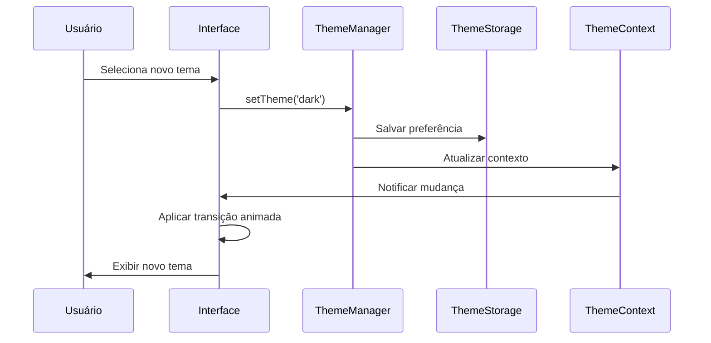

# Documento de Design - Temas Claro/Escuro

## Visão Geral

O sistema de temas permitirá alternância fluida entre aparências clara e escura, com suporte a detecção automática das preferências do sistema operacional. A implementação utilizará o sistema de design tokens do Tailwind CSS, Context API do React para gerenciamento de estado e AsyncStorage para persistência de preferências.

### Conceitos Principais

- **Design Tokens**: Valores de design centralizados (cores, espaçamentos, tipografia)
- **Theme Provider**: Context que fornece tema atual para toda a aplicação
- **Adaptive Components**: Componentes que se adaptam automaticamente ao tema
- **System Integration**: Detecção e sincronização com preferências do SO
- **Smooth Transitions**: Animações suaves durante mudanças de tema

## Arquitetura

### Componentes Principais

```
┌─────────────────────────────────────────────────────────────┐
│                    ThemeProvider                            │
│  ┌─────────────────┐  ┌─────────────────┐  ┌──────────────┐ │
│  │  ThemeContext   │  │ ThemeManager    │  │ ThemeStorage │ │
│  └─────────────────┘  └─────────────────┘  └──────────────┘ │
└─────────────────────────────────────────────────────────────┘
                              │
                              ▼
┌─────────────────────────────────────────────────────────────┐
│                 Design Token System                         │
│  ┌─────────────────┐  ┌─────────────────┐  ┌──────────────┐ │
│  │   ColorTokens   │  │ TypographyTokens│  │ SpacingTokens│ │
│  └─────────────────┘  └─────────────────┘  └──────────────┘ │
└─────────────────────────────────────────────────────────────┘
                              │
                              ▼
┌─────────────────────────────────────────────────────────────┐
│              Component Adaptation Layer                     │
│  ┌─────────────────┐  ┌─────────────────┐  ┌──────────────┐ │
│  │ ThemedComponents│  │  IconAdapter    │  │ ImageAdapter │ │
│  └─────────────────┘  └─────────────────┘  └──────────────┘ │
└─────────────────────────────────────────────────────────────┘
```

### Fluxo de Mudança de Tema



## Componentes e Interfaces

### 1. ThemeProvider e Context

```typescript
interface ThemeContextValue {
  theme: Theme;
  themeMode: ThemeMode;
  setTheme: (mode: ThemeMode) => void;
  toggleTheme: () => void;
  isSystemTheme: boolean;
  systemTheme: 'light' | 'dark';
}

enum ThemeMode {
  LIGHT = 'light',
  DARK = 'dark',
  SYSTEM = 'system'
}

interface Theme {
  mode: 'light' | 'dark';
  colors: ColorPalette;
  typography: TypographyScale;
  spacing: SpacingScale;
  shadows: ShadowScale;
  animations: AnimationConfig;
}

interface ColorPalette {
  // Cores primárias
  primary: ColorScale;
  secondary: ColorScale;
  accent: ColorScale;
  
  // Cores semânticas
  success: ColorScale;
  warning: ColorScale;
  error: ColorScale;
  info: ColorScale;
  
  // Cores de superfície
  background: string;
  surface: string;
  card: string;
  
  // Cores de texto
  text: {
    primary: string;
    secondary: string;
    disabled: string;
    inverse: string;
  };
  
  // Cores de borda
  border: {
    default: string;
    focus: string;
    error: string;
  };
  
  // Cores de overlay
  overlay: string;
  backdrop: string;
}

interface ColorScale {
  50: string;
  100: string;
  200: string;
  300: string;
  400: string;
  500: string; // cor base
  600: string;
  700: string;
  800: string;
  900: string;
}
```

### 2. ThemeManager

```typescript
interface ThemeManager {
  // Gerenciamento de tema
  getCurrentTheme(): Theme;
  setThemeMode(mode: ThemeMode): Promise<void>;
  getThemeMode(): ThemeMode;
  
  // Detecção do sistema
  getSystemTheme(): 'light' | 'dark';
  subscribeToSystemChanges(callback: (theme: 'light' | 'dark') => void): () => void;
  
  // Personalização
  customizeTheme(customizations: Partial<Theme>): Promise<void>;
  resetTheme(): Promise<void>;
  
  // Validação
  validateThemeContrast(theme: Theme): ContrastReport;
  suggestContrastFixes(theme: Theme): ContrastSuggestion[];
}

interface ContrastReport {
  isValid: boolean;
  issues: ContrastIssue[];
  score: number; // 0-100
}

interface ContrastIssue {
  element: string;
  currentRatio: number;
  requiredRatio: number;
  severity: 'error' | 'warning';
  suggestion: string;
}
```

### 3. Design Tokens

```typescript
// Tokens de cor para tema claro
const lightTheme: Theme = {
  mode: 'light',
  colors: {
    primary: {
      50: '#f0f9ff',
      100: '#e0f2fe',
      200: '#bae6fd',
      300: '#7dd3fc',
      400: '#38bdf8',
      500: '#0ea5e9', // cor base
      600: '#0284c7',
      700: '#0369a1',
      800: '#075985',
      900: '#0c4a6e'
    },
    background: '#ffffff',
    surface: '#f8fafc',
    card: '#ffffff',
    text: {
      primary: '#1e293b',
      secondary: '#64748b',
      disabled: '#cbd5e1',
      inverse: '#ffffff'
    },
    border: {
      default: '#e2e8f0',
      focus: '#0ea5e9',
      error: '#ef4444'
    }
    // ... outras cores
  },
  // ... outras propriedades
};

// Tokens de cor para tema escuro
const darkTheme: Theme = {
  mode: 'dark',
  colors: {
    primary: {
      50: '#0c4a6e',
      100: '#075985',
      200: '#0369a1',
      300: '#0284c7',
      400: '#0ea5e9',
      500: '#38bdf8', // cor base ajustada para escuro
      600: '#7dd3fc',
      700: '#bae6fd',
      800: '#e0f2fe',
      900: '#f0f9ff'
    },
    background: '#0f172a',
    surface: '#1e293b',
    card: '#334155',
    text: {
      primary: '#f1f5f9',
      secondary: '#cbd5e1',
      disabled: '#64748b',
      inverse: '#1e293b'
    },
    border: {
      default: '#475569',
      focus: '#38bdf8',
      error: '#f87171'
    }
    // ... outras cores
  },
  // ... outras propriedades
};
```

### 4. Componentes Adaptativos

```typescript
// Hook para usar tema atual
function useTheme(): ThemeContextValue {
  const context = useContext(ThemeContext);
  if (!context) {
    throw new Error('useTheme must be used within ThemeProvider');
  }
  return context;
}

// Hook para estilos baseados em tema
function useThemedStyles<T>(styleFactory: (theme: Theme) => T): T {
  const { theme } = useTheme();
  return useMemo(() => styleFactory(theme), [theme, styleFactory]);
}

// Componente de texto adaptativo
interface ThemedTextProps extends TextProps {
  variant?: 'primary' | 'secondary' | 'disabled' | 'inverse';
  color?: keyof Theme['colors'];
}

const ThemedText: React.FC<ThemedTextProps> = ({ 
  variant = 'primary', 
  color,
  style,
  ...props 
}) => {
  const { theme } = useTheme();
  
  const textColor = color 
    ? theme.colors[color]
    : theme.colors.text[variant];
  
  return (
    <Text 
      style={[{ color: textColor }, style]} 
      {...props} 
    />
  );
};

// Componente de superfície adaptativa
interface ThemedSurfaceProps extends ViewProps {
  variant?: 'background' | 'surface' | 'card';
  elevation?: number;
}

const ThemedSurface: React.FC<ThemedSurfaceProps> = ({
  variant = 'surface',
  elevation = 0,
  style,
  ...props
}) => {
  const { theme } = useTheme();
  
  const backgroundColor = theme.colors[variant];
  const shadow = elevation > 0 ? theme.shadows[elevation] : {};
  
  return (
    <View 
      style={[
        { backgroundColor },
        shadow,
        style
      ]} 
      {...props} 
    />
  );
};
```

## Integração com Tailwind CSS

### Configuração do Tailwind

```javascript
// tailwind.config.js
module.exports = {
  content: ['./app/**/*.{js,jsx,ts,tsx}', './components/**/*.{js,jsx,ts,tsx}'],
  theme: {
    extend: {
      colors: {
        // Cores que mudam com o tema
        primary: 'var(--color-primary)',
        secondary: 'var(--color-secondary)',
        background: 'var(--color-background)',
        surface: 'var(--color-surface)',
        'text-primary': 'var(--color-text-primary)',
        'text-secondary': 'var(--color-text-secondary)',
        
        // Cores específicas do tema claro
        light: {
          primary: '#0ea5e9',
          background: '#ffffff',
          surface: '#f8fafc',
          text: '#1e293b'
        },
        
        // Cores específicas do tema escuro
        dark: {
          primary: '#38bdf8',
          background: '#0f172a',
          surface: '#1e293b',
          text: '#f1f5f9'
        }
      }
    }
  },
  plugins: [
    // Plugin personalizado para variáveis CSS
    function({ addBase, theme }) {
      addBase({
        ':root': {
          '--color-primary': theme('colors.light.primary'),
          '--color-background': theme('colors.light.background'),
          '--color-surface': theme('colors.light.surface'),
          '--color-text-primary': theme('colors.light.text'),
        },
        '[data-theme="dark"]': {
          '--color-primary': theme('colors.dark.primary'),
          '--color-background': theme('colors.dark.background'),
          '--color-surface': theme('colors.dark.surface'),
          '--color-text-primary': theme('colors.dark.text'),
        }
      });
    }
  ]
};
```

### Uso com NativeWind

```typescript
// Componente usando classes Tailwind adaptativas
const ThemedButton: React.FC<ButtonProps> = ({ children, ...props }) => {
  return (
    <Pressable 
      className="bg-primary px-4 py-2 rounded-lg active:bg-primary/80"
      {...props}
    >
      <Text className="text-white font-medium text-center">
        {children}
      </Text>
    </Pressable>
  );
};

// Componente com classes condicionais baseadas no tema
const ThemedCard: React.FC<CardProps> = ({ children }) => {
  const { theme } = useTheme();
  
  return (
    <View 
      className={`
        p-4 rounded-xl border
        ${theme.mode === 'dark' 
          ? 'bg-dark-surface border-gray-600' 
          : 'bg-white border-gray-200'
        }
      `}
    >
      {children}
    </View>
  );
};
```

## Detecção do Sistema Operacional

### Implementação para iOS/Android

```typescript
import { Appearance } from 'react-native';

class SystemThemeDetector {
  private listeners: ((theme: 'light' | 'dark') => void)[] = [];
  
  constructor() {
    // Listener para mudanças do sistema
    Appearance.addChangeListener(({ colorScheme }) => {
      const theme = colorScheme === 'dark' ? 'dark' : 'light';
      this.notifyListeners(theme);
    });
  }
  
  getCurrentSystemTheme(): 'light' | 'dark' {
    const colorScheme = Appearance.getColorScheme();
    return colorScheme === 'dark' ? 'dark' : 'light';
  }
  
  subscribe(callback: (theme: 'light' | 'dark') => void): () => void {
    this.listeners.push(callback);
    
    // Retorna função de cleanup
    return () => {
      const index = this.listeners.indexOf(callback);
      if (index > -1) {
        this.listeners.splice(index, 1);
      }
    };
  }
  
  private notifyListeners(theme: 'light' | 'dark'): void {
    this.listeners.forEach(listener => listener(theme));
  }
}
```

## Animações de Transição

### Implementação de Transições Suaves

```typescript
import { useSharedValue, withTiming, useAnimatedStyle } from 'react-native-reanimated';

interface ThemeTransitionProps {
  children: React.ReactNode;
  duration?: number;
}

const ThemeTransition: React.FC<ThemeTransitionProps> = ({ 
  children, 
  duration = 300 
}) => {
  const { theme } = useTheme();
  const opacity = useSharedValue(1);
  
  useEffect(() => {
    // Fade out, change theme, fade in
    opacity.value = withTiming(0, { duration: duration / 2 }, () => {
      opacity.value = withTiming(1, { duration: duration / 2 });
    });
  }, [theme.mode]);
  
  const animatedStyle = useAnimatedStyle(() => ({
    opacity: opacity.value
  }));
  
  return (
    <Animated.View style={[{ flex: 1 }, animatedStyle]}>
      {children}
    </Animated.View>
  );
};

// Hook para animações de cor
function useAnimatedThemeColor(colorKey: keyof ColorPalette): any {
  const { theme } = useTheme();
  const animatedColor = useSharedValue(theme.colors[colorKey]);
  
  useEffect(() => {
    animatedColor.value = withTiming(theme.colors[colorKey], {
      duration: 200
    });
  }, [theme.colors[colorKey]]);
  
  return animatedColor;
}
```

## Persistência de Preferências

### Armazenamento Local

```typescript
import AsyncStorage from '@react-native-async-storage/async-storage';

class ThemeStorage {
  private static readonly THEME_KEY = '@app_theme_mode';
  private static readonly CUSTOM_THEME_KEY = '@app_custom_theme';
  
  static async saveThemeMode(mode: ThemeMode): Promise<void> {
    try {
      await AsyncStorage.setItem(this.THEME_KEY, mode);
    } catch (error) {
      console.error('Failed to save theme mode:', error);
    }
  }
  
  static async getThemeMode(): Promise<ThemeMode> {
    try {
      const mode = await AsyncStorage.getItem(this.THEME_KEY);
      return (mode as ThemeMode) || ThemeMode.SYSTEM;
    } catch (error) {
      console.error('Failed to load theme mode:', error);
      return ThemeMode.SYSTEM;
    }
  }
  
  static async saveCustomTheme(theme: Partial<Theme>): Promise<void> {
    try {
      const json = JSON.stringify(theme);
      await AsyncStorage.setItem(this.CUSTOM_THEME_KEY, json);
    } catch (error) {
      console.error('Failed to save custom theme:', error);
    }
  }
  
  static async getCustomTheme(): Promise<Partial<Theme> | null> {
    try {
      const json = await AsyncStorage.getItem(this.CUSTOM_THEME_KEY);
      return json ? JSON.parse(json) : null;
    } catch (error) {
      console.error('Failed to load custom theme:', error);
      return null;
    }
  }
}
```

## Validação de Acessibilidade

### Verificação de Contraste

```typescript
class ContrastValidator {
  // Calcular luminância relativa de uma cor
  static getRelativeLuminance(color: string): number {
    const rgb = this.hexToRgb(color);
    if (!rgb) return 0;
    
    const [r, g, b] = [rgb.r, rgb.g, rgb.b].map(c => {
      c = c / 255;
      return c <= 0.03928 ? c / 12.92 : Math.pow((c + 0.055) / 1.055, 2.4);
    });
    
    return 0.2126 * r + 0.7152 * g + 0.0722 * b;
  }
  
  // Calcular razão de contraste entre duas cores
  static getContrastRatio(color1: string, color2: string): number {
    const lum1 = this.getRelativeLuminance(color1);
    const lum2 = this.getRelativeLuminance(color2);
    
    const brightest = Math.max(lum1, lum2);
    const darkest = Math.min(lum1, lum2);
    
    return (brightest + 0.05) / (darkest + 0.05);
  }
  
  // Verificar se contraste atende aos padrões WCAG
  static meetsWCAGStandard(
    foreground: string, 
    background: string, 
    level: 'AA' | 'AAA' = 'AA',
    size: 'normal' | 'large' = 'normal'
  ): boolean {
    const ratio = this.getContrastRatio(foreground, background);
    
    const requirements = {
      AA: { normal: 4.5, large: 3 },
      AAA: { normal: 7, large: 4.5 }
    };
    
    return ratio >= requirements[level][size];
  }
  
  // Validar tema completo
  static validateTheme(theme: Theme): ContrastReport {
    const issues: ContrastIssue[] = [];
    
    // Verificar texto primário
    const textPrimaryRatio = this.getContrastRatio(
      theme.colors.text.primary,
      theme.colors.background
    );
    
    if (textPrimaryRatio < 4.5) {
      issues.push({
        element: 'Primary Text',
        currentRatio: textPrimaryRatio,
        requiredRatio: 4.5,
        severity: 'error',
        suggestion: 'Increase contrast between text and background'
      });
    }
    
    // Verificar outros elementos...
    
    return {
      isValid: issues.filter(i => i.severity === 'error').length === 0,
      issues,
      score: this.calculateScore(issues)
    };
  }
  
  private static calculateScore(issues: ContrastIssue[]): number {
    const errorPenalty = issues.filter(i => i.severity === 'error').length * 20;
    const warningPenalty = issues.filter(i => i.severity === 'warning').length * 10;
    
    return Math.max(0, 100 - errorPenalty - warningPenalty);
  }
  
  private static hexToRgb(hex: string): { r: number; g: number; b: number } | null {
    const result = /^#?([a-f\d]{2})([a-f\d]{2})([a-f\d]{2})$/i.exec(hex);
    return result ? {
      r: parseInt(result[1], 16),
      g: parseInt(result[2], 16),
      b: parseInt(result[3], 16)
    } : null;
  }
}
```

## Configurações de Usuário

### Interface de Configuração

```typescript
interface ThemeSettingsProps {
  currentTheme: ThemeMode;
  onThemeChange: (theme: ThemeMode) => void;
  customizations: Partial<Theme>;
  onCustomizationChange: (customizations: Partial<Theme>) => void;
}

const ThemeSettings: React.FC<ThemeSettingsProps> = ({
  currentTheme,
  onThemeChange,
  customizations,
  onCustomizationChange
}) => {
  return (
    <ThemedSurface variant="card" className="p-4 rounded-xl">
      <ThemedText variant="primary" className="text-lg font-semibold mb-4">
        Aparência
      </ThemedText>
      
      {/* Seletor de tema */}
      <View className="mb-6">
        <ThemedText variant="secondary" className="mb-2">
          Tema
        </ThemedText>
        <SegmentedControl
          values={['Claro', 'Escuro', 'Automático']}
          selectedIndex={Object.values(ThemeMode).indexOf(currentTheme)}
          onChange={(event) => {
            const modes = Object.values(ThemeMode);
            onThemeChange(modes[event.nativeEvent.selectedSegmentIndex]);
          }}
        />
      </View>
      
      {/* Personalização de cores */}
      <View className="mb-6">
        <ThemedText variant="secondary" className="mb-2">
          Cor de destaque
        </ThemedText>
        <ColorPicker
          color={customizations.colors?.primary?.['500'] || '#0ea5e9'}
          onColorChange={(color) => {
            onCustomizationChange({
              ...customizations,
              colors: {
                ...customizations.colors,
                primary: generateColorScale(color)
              }
            });
          }}
        />
      </View>
      
      {/* Preview do tema */}
      <ThemePreview theme={currentTheme} customizations={customizations} />
    </ThemedSurface>
  );
};
```

## Estratégia de Testes

### Testes de Componentes

```typescript
describe('ThemeProvider', () => {
  test('should provide theme context to children', () => {
    const TestComponent = () => {
      const { theme } = useTheme();
      return <Text testID="theme-mode">{theme.mode}</Text>;
    };
    
    render(
      <ThemeProvider initialTheme={ThemeMode.DARK}>
        <TestComponent />
      </ThemeProvider>
    );
    
    expect(screen.getByTestId('theme-mode')).toHaveTextContent('dark');
  });
  
  test('should switch themes correctly', async () => {
    const TestComponent = () => {
      const { theme, setTheme } = useTheme();
      return (
        <View>
          <Text testID="theme-mode">{theme.mode}</Text>
          <Button 
            testID="switch-theme"
            title="Switch" 
            onPress={() => setTheme(ThemeMode.DARK)} 
          />
        </View>
      );
    };
    
    render(
      <ThemeProvider initialTheme={ThemeMode.LIGHT}>
        <TestComponent />
      </ThemeProvider>
    );
    
    expect(screen.getByTestId('theme-mode')).toHaveTextContent('light');
    
    fireEvent.press(screen.getByTestId('switch-theme'));
    
    await waitFor(() => {
      expect(screen.getByTestId('theme-mode')).toHaveTextContent('dark');
    });
  });
});
```

### Testes de Acessibilidade

```typescript
describe('Theme Accessibility', () => {
  test('should meet WCAG contrast requirements', () => {
    const lightTheme = createLightTheme();
    const darkTheme = createDarkTheme();
    
    const lightReport = ContrastValidator.validateTheme(lightTheme);
    const darkReport = ContrastValidator.validateTheme(darkTheme);
    
    expect(lightReport.isValid).toBe(true);
    expect(darkReport.isValid).toBe(true);
    expect(lightReport.score).toBeGreaterThan(80);
    expect(darkReport.score).toBeGreaterThan(80);
  });
});
```

### Testes de Performance

```typescript
describe('Theme Performance', () => {
  test('should not cause excessive re-renders', () => {
    const renderCount = jest.fn();
    
    const TestComponent = () => {
      renderCount();
      const { theme } = useTheme();
      return <Text>{theme.mode}</Text>;
    };
    
    const { rerender } = render(
      <ThemeProvider>
        <TestComponent />
      </ThemeProvider>
    );
    
    // Múltiplas re-renderizações não devem causar re-renders desnecessários
    rerender(
      <ThemeProvider>
        <TestComponent />
      </ThemeProvider>
    );
    
    expect(renderCount).toHaveBeenCalledTimes(1);
  });
});
```