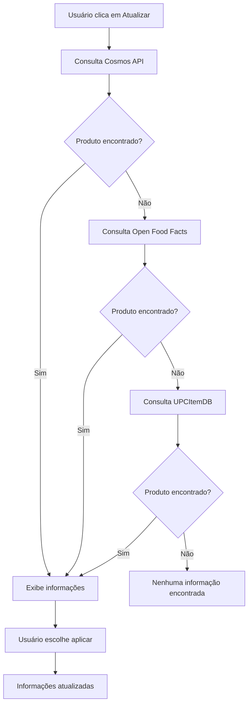

# Integração com APIs de Código de Barras

## Visão Geral

A funcionalidade de edição de produtos específicos agora inclui integração com múltiplas APIs de códigos de barras para atualização automática de informações como nome, marca, descrição e imagem do produto.

## APIs Integradas

### 1. Cosmos API (Produtos Brasileiros)
- **Fonte**: Bluesoft Cosmos
- **Cobertura**: Produtos brasileiros com GTIN/EAN
- **Informações**: Nome, marca, categoria, NCM, imagem, preço médio
- **Confiança**: 90%
- **Configuração**: Requer `EXPO_PUBLIC_COSMOS_API_KEY`

### 2. Open Food Facts (Gratuita)
- **Fonte**: Base colaborativa mundial
- **Cobertura**: Produtos alimentícios internacionais
- **Informações**: Nome, marca, categoria, ingredientes, informações nutricionais, imagem
- **Confiança**: 80%
- **Configuração**: Não requer chave (gratuita)

### 3. UPCItemDB (Fallback)
- **Fonte**: Base comercial de produtos
- **Cobertura**: Produtos diversos internacionais
- **Informações**: Nome, marca, categoria, imagem, descrição
- **Confiança**: 70%
- **Configuração**: Requer `EXPO_PUBLIC_UPCITEMDB_API_KEY`

## Como Usar

### 1. Editar Produto Específico

1. **Acesse a tela de produtos específicos**
2. **Selecione um produto com código de barras**
3. **Toque em "Editar"**
4. **Na seção "Atualizar via Código de Barras"**
5. **Toque em "Atualizar Informações"**

### 2. Processo de Atualização



### 3. Informações Atualizadas

As seguintes informações podem ser atualizadas automaticamente:

- ✅ **Nome do produto**
- ✅ **Marca**
- ✅ **Descrição**
- ✅ **Imagem**
- ✅ **Categoria** (sugerida)
- ✅ **Informações nutricionais** (quando disponível)
- ✅ **Ingredientes** (quando disponível)

## Configuração das APIs

### Variáveis de Ambiente

Adicione as seguintes variáveis no arquivo `.env`:

```env
# Cosmos API (Opcional - para produtos brasileiros)
EXPO_PUBLIC_COSMOS_API_KEY=sua_chave_cosmos_aqui

# UPCItemDB API (Opcional - fallback)
EXPO_PUBLIC_UPCITEMDB_API_KEY=sua_chave_upcitemdb_aqui
```

### Obter Chaves de API

#### Cosmos API
1. Acesse [Cosmos API](https://cosmos.bluesoft.com.br/)
2. Crie uma conta
3. Obtenha sua chave de API
4. Adicione ao `.env` como `EXPO_PUBLIC_COSMOS_API_KEY`

#### UPCItemDB
1. Acesse [UPCItemDB](https://www.upcitemdb.com/)
2. Crie uma conta
3. Obtenha sua chave de API
4. Adicione ao `.env` como `EXPO_PUBLIC_UPCITEMDB_API_KEY`

## Funcionalidades

### 1. Busca Inteligente
- **Priorização**: Cosmos → Open Food Facts → UPCItemDB
- **Fallback**: Se uma API falha, tenta a próxima
- **Cache**: Resultados são armazenados localmente
- **Timeout**: 10 segundos por API

### 2. Validação de Códigos
- **Formatos suportados**: EAN-8, EAN-13, UPC-A, UPC-E
- **Validação**: Verifica formato antes de consultar APIs
- **Formatação**: Exibe códigos formatados para melhor legibilidade

### 3. Interface Intuitiva
- **Modal informativo**: Exibe todas as informações encontradas
- **Comparação**: Mostra dados atuais vs. dados da API
- **Seleção**: Usuário escolhe quais informações aplicar
- **Feedback**: Indicadores de confiança e fonte dos dados

### 4. Tratamento de Erros
- **Conectividade**: Funciona offline com dados em cache
- **APIs indisponíveis**: Fallback automático para outras fontes
- **Dados incompletos**: Aplica apenas informações disponíveis
- **Timeout**: Não trava a interface se APIs estiverem lentas

## Exemplos de Uso

### Produto Brasileiro (Cosmos API)
```typescript
// Código: 7891234567890
// Resultado:
{
  name: "Arroz Tio João Tipo 1 1kg",
  brand: "Tio João",
  category: "Mercearia",
  image: "https://...",
  source: "cosmos",
  confidence: 0.9
}
```

### Produto Internacional (Open Food Facts)
```typescript
// Código: 3017620422003
// Resultado:
{
  name: "Nutella",
  brand: "Ferrero",
  category: "Mercearia",
  image: "https://...",
  nutritionalInfo: { ... },
  source: "openfoodfacts",
  confidence: 0.8
}
```

## Benefícios

### Para o Usuário
- ✅ **Economia de tempo**: Não precisa digitar informações manualmente
- ✅ **Dados precisos**: Informações oficiais dos fabricantes
- ✅ **Imagens de qualidade**: Fotos profissionais dos produtos
- ✅ **Informações completas**: Dados nutricionais e ingredientes

### Para o App
- ✅ **Base de dados rica**: Produtos com informações completas
- ✅ **Padronização**: Nomes e categorias consistentes
- ✅ **Experiência melhorada**: Interface mais profissional
- ✅ **Escalabilidade**: Suporte a milhões de produtos

## Limitações

### APIs Externas
- **Dependência de internet**: Requer conexão para consultas
- **Limites de uso**: APIs podem ter quotas diárias
- **Disponibilidade**: APIs podem estar temporariamente indisponíveis
- **Cobertura**: Nem todos os produtos estão nas bases

### Dados
- **Qualidade variável**: Informações podem estar desatualizadas
- **Idioma**: Alguns produtos podem ter nomes em outros idiomas
- **Regionalização**: Produtos podem ter nomes diferentes por região

## Troubleshooting

### Produto não encontrado
1. **Verifique o código**: Confirme se o código de barras está correto
2. **Tente manualmente**: Digite o código manualmente se o scanner falhar
3. **Produto regional**: Produtos muito locais podem não estar nas APIs
4. **Código inválido**: Alguns códigos podem ser internos da loja

### API não responde
1. **Verifique conexão**: Confirme se há internet disponível
2. **Chaves de API**: Verifique se as chaves estão configuradas corretamente
3. **Quotas**: Verifique se não excedeu os limites das APIs
4. **Status das APIs**: Algumas APIs podem estar em manutenção

### Informações incorretas
1. **Fonte dos dados**: Verifique qual API forneceu os dados
2. **Confiança**: Dados com baixa confiança podem ser imprecisos
3. **Edição manual**: Sempre é possível editar manualmente após aplicar
4. **Feedback**: Reporte problemas para melhorar a base de dados

## Roadmap

### Próximas Funcionalidades
- [ ] **Cache inteligente**: Armazenamento local de produtos consultados
- [ ] **Sincronização offline**: Atualizar quando voltar online
- [ ] **APIs adicionais**: Integração com mais fontes de dados
- [ ] **Machine Learning**: Sugestões baseadas em padrões de uso
- [ ] **Crowdsourcing**: Permitir usuários contribuírem com dados
- [ ] **Validação cruzada**: Comparar dados entre múltiplas APIs

### Melhorias Planejadas
- [ ] **Performance**: Otimização de consultas e cache
- [ ] **UX**: Interface mais intuitiva para seleção de dados
- [ ] **Localização**: Priorizar APIs baseado na localização do usuário
- [ ] **Histórico**: Manter histórico de atualizações via API